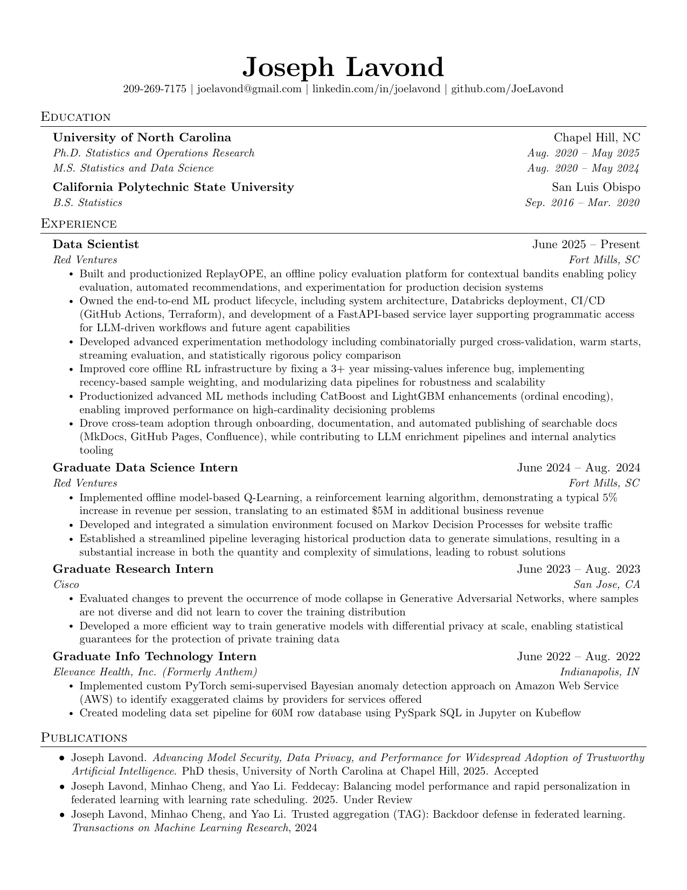
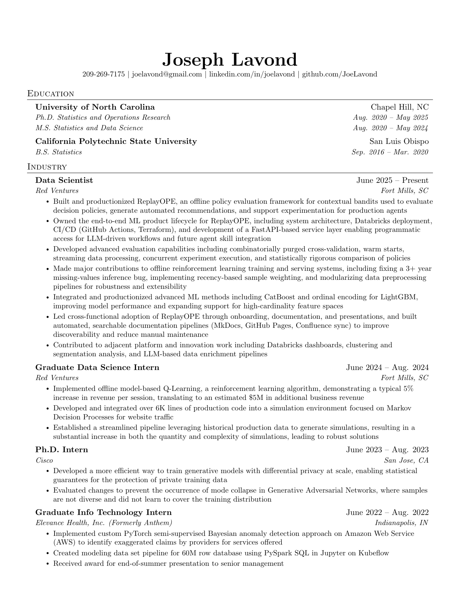
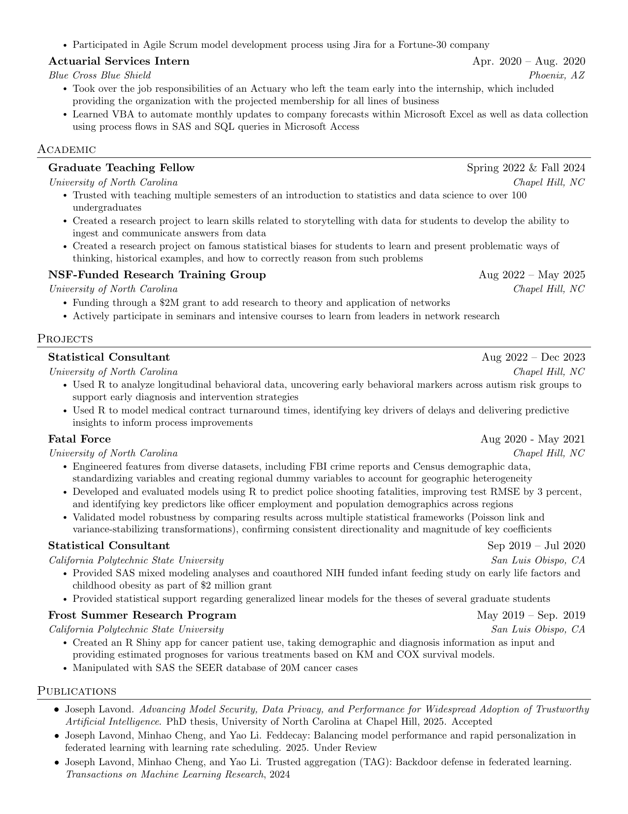
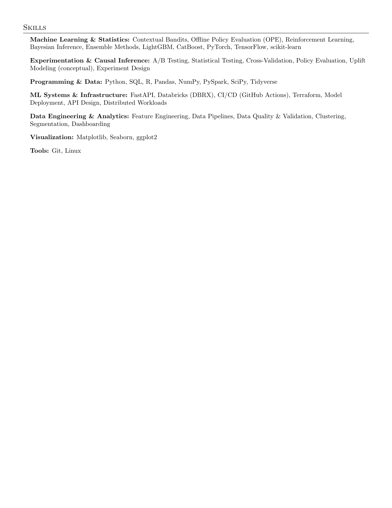

## Setup (macOS)

```bash
brew install --cask basictex && brew install poppler
```

After installing BasicTeX, open a new terminal so `/usr/local/texlive/.../bin` is on your PATH.

## Build

```bash
make          # compile both documents and generate PNGs
make resume   # compile resume only (PDF)
make cv       # compile CV only (PDF)
make pngs     # generate PNGs from compiled PDFs
make clean    # remove LaTeX auxiliary files (keeps PDFs and PNGs)
```

---

<!---
# For single-page resume
<figure align="center">
    
</figure>
--->

<!---
# For multi-page CV
--->
<figure align="center">
    
</figure>

<figure align="center">
    
</figure>

<figure align="center">
    
</figure>
